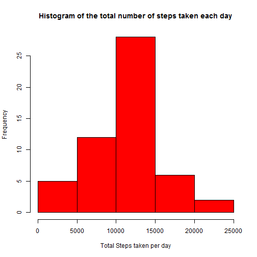
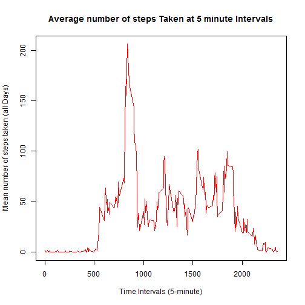
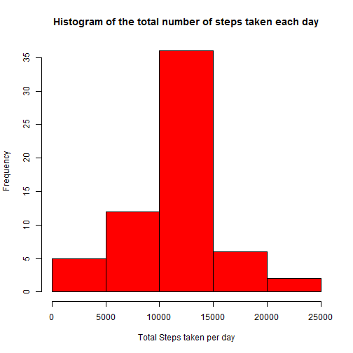
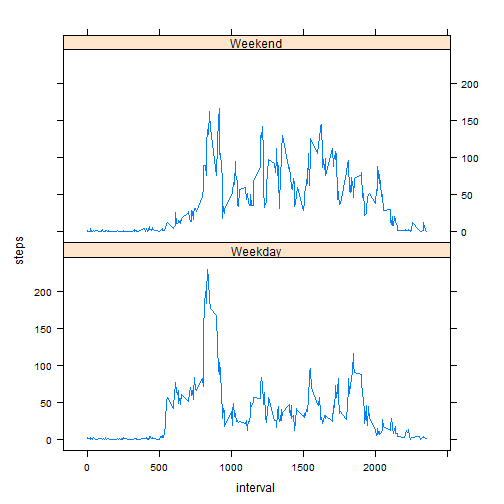

------------------------------------
title: "PA1_template.Rmd"
output: html_document
------------------------------------
# 1. Code for reading in the dataset and/or processing the data

### Load packages...

```r
library("data.table")
library(ggplot2)
```

### Unzipping and Loading Files


```r
path <- getwd()
download.file(url = "https://d396qusza40orc.cloudfront.net/repdata%2Fdata%2Factivity.zip"
              , destfile = paste(path, "activity.zip", sep = "/"))
unzip(zipfile = "activity.zip")
```

### Read File

```r
activity <- read.table("activity.csv", sep=",", header=T)
```

# 2. Histogram of the total number of steps taken each day

### Aggregate sum of steps by date

```r
totalSteps <- aggregate(steps ~ date, data = activity, sum, na.rm = TRUE)
```

### Histogram of the total number of steps taken each day

```r
hist(totalSteps$steps,col="red",main="Histogram of the total number of steps taken each day",xlab="Total Steps taken per day")
```



# 3. Mean and median number of steps taken each day


```r
mean_steps <- mean(totalSteps$steps)
median_steps <- median(totalSteps$steps)
```
#### Mean steps taken each day are 10766
#### Median steps taken each day are 10765

# 4. Time series plot of the average number of steps taken


```r
averSteps <- aggregate(steps ~ interval, data = activity, mean, na.rm = TRUE)

plot(steps ~ interval, data = averSteps, type = "l", xlab = "Time Intervals (5-minute)", ylab = "Mean number of steps taken (all Days)", main = "Average number of steps Taken at 5 minute Intervals",  col = "red")
```




# 5. The 5-minute interval that, on average, contains the maximum number of steps


```r
MaxInterval<-averSteps[which.max(averSteps$steps),1]
```


####interval 835 is the 5-minute interval with the maximum number of steps

# 6. Code to describe and show a strategy for imputing missing data

### Calculate and report the total number of missing values in the dataset (i.e. the total number of rows with NAs)


```r
MissingValues<-sum(!complete.cases(activity))
```
#### The number of missing values in the dataset is 2304

### Devise a strategy for filling in all of the missing values in the dataset. The strategy does not need to be sophisticated. For example, you could use the mean/median for that day, or the mean for that 5-minute interval, etc.

#### built a function in order to get the mean steps for each interval

```r
Mean_Steps_Interval <- function(interval){
    averSteps[averSteps$interval==interval,"steps"]
}
```
### Create a new dataset that is equal to the original dataset but with the missing data filled in.
#### Replace Missing Values with Average steps per interval 


```r
complete_activity<-activity

for (i in 1:nrow(complete_activity)) {
    if (is.na(complete_activity[i,"steps"])) {
        complete_activity[i,"steps"] <- Mean_Steps_Interval(complete_activity[i,"interval"])
    }
}
```

####aggregate sum of steps by date for new Dataset


```r
totalNewSteps <- aggregate(steps ~ date, data = complete_activity,sum)
```

# 7. Histogram of the total number of steps taken each day after missing values are imputed

###Histogram of the total number of steps taken each day after missing values are imputed

```r
hist(totalNewSteps$steps,col="red",main="Histogram of the total number of steps taken each day",xlab="Total Steps taken per day")
```



### Mean and median number of steps taken each day


```r
new_mean_steps <- mean(totalNewSteps$steps)
new_median_steps <- median(totalNewSteps$steps)
```
##### New Mean steps taken each day are 10766
##### New Median steps taken each day are 10766

### Do these values differ from the estimates from the first part of the assignment? What is the impact of imputing missing data on the estimates of the total daily number of steps?

#### mean is the same but median has slightly increased 

# 8. Panel plot comparing the average number of steps taken per 5-minute interval across weekdays and weekends

### Are there differences in activity patterns between weekdays and weekends?

####create a new column with the num of the week 0-6 

```r
complete_activity$numdate<-as.POSIXlt(as.Date(complete_activity$date))$wda
```
####Create a new factor variable in the dataset with two levels  weekday and weekend indicating whether a given date is a weekday or weekend day.


```r
complete_activity$day<-ifelse(as.POSIXlt(complete_activity$date)$wday==6 | as.POSIXlt(complete_activity$date)$wday==0,"Weekend","Weekday")

complete_activity$day <- factor(complete_activity$day, levels = c("Weekday", "Weekend"))
```

#### Make a panel plot containing a time series plot (i.e. type = "l???) of the 5-minute interval (x-axis) and the average number of steps taken, averaged across all weekday days or weekend days (y-axis).


```r
steps_interval= aggregate(steps ~ interval + day, complete_activity, mean)

library(lattice)
xyplot(steps ~ interval | factor(day), data = steps_interval, aspect = 1/2, 
       type = "l")
```


